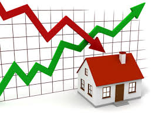

# Kings County Housing Price Predictions

***BUSINESS PROBLEM***  

The business problem is simple: how can we best predict the house prices contained within the holdout data set? 

In order to tackle that problem, we were given access to the following information about just over 17,000 houses in the Kings County area:

* **id** - unique ID for a house
* **date** - Date day house was sold
* **price** - Price is prediction target
* **bedrooms** - Number of bedrooms
* **bathrooms** - Number of bathrooms
* **sqft_living** - square footage of the home
* **sqft_lot** - square footage of the lot
* **floors** - Total floors (levels) in house
* **waterfront** - Whether house has a view to a waterfront
* **view** - Number of times house has been viewed
* **condition** - How good the condition is (overall)
* **grade** - overall grade given to the housing unit, based on King County grading system
* **sqft_above** - square footage of house (apart from basement)
* **sqft_basement** - square footage of the basement
* **yr_built** - Year when house was built
* **yr_renovated** - Year when house was renovated
* **zipcode** - zip code in which house is located
* **lat** - Latitude coordinate
* **long** - Longitude coordinate
* **sqft_living15** - The square footage of interior housing living space for the nearest 15 neighbors
* **sqft_lot15** - The square footage of the land lots of the nearest 15 neighbors

**REPOSITORY STRUCTURE**

This repository is structured as follows: 

- archive: contains all the behind-the-scenes work of the final notebook. This is the place where I have placed all of my exloratory data analysis, my cleaning, and my model iterations.

- data: contains the data on Kings Country houses that was used in the making of the final model. It also contains the holdout data set in which the final model is intended to blindly predict prices on as the holdout set does not contain a price column.

- final_notebook: contains the polished and interactive version of the final model.

- holdout_set: contains the steps included in fitting the final model to the holdout data set.

- housing_preds_michael_wirtz.csv: contains the final predictions on the holdout data set given by the final model.

**FINDINGS**

Like any other modelling project, there were many decisions made that affected either the interpretability and the predictive abilitive of the model. Given the large number of columns, inlcuding many dummy columns, that existed in the final model, the model was low on interpretability. That did, however, allow for a greater level of predictability in the model. 

By the end of the modelling process, the final model had an RMSE of just over 140,000. While this number was far better than the dummy model RMSE of about 375,000, there is much room for improvement in this model.

Ways the model could have been improved:

- Variance of data points increased with price (with a little more time I would have taken the log of price or performed some other type of transformation)
- I did not have enough time to perform any interactions or create any polynomial features (this would presumably be able to add a bit more predictability to the model)
- Pressed for time, I did a quick and arbitrary feature selection using KBest (with more time I would have gone through different selection methods, possibly combining a few, to find the highest predictability)

